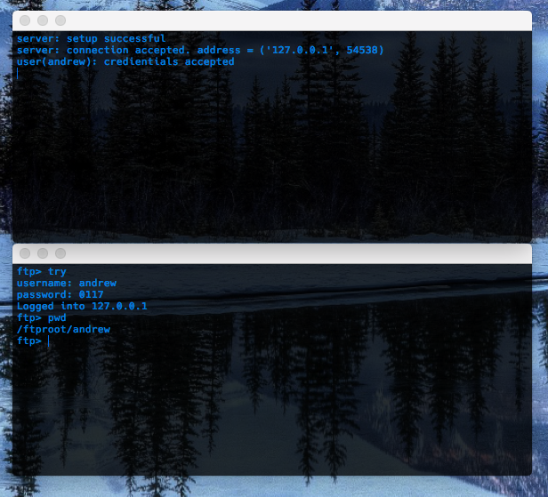

# Ftpsoft
An ftp server and client written for my net centrics class. 

## Purpose
The purpose of the project is to write an ftp client and server that's as close to being RFC certified as possible. Helped me understand sockets and concurrency.

## Index
* **Client:** [client](./source/ftp\_client.py)  
* **Server:** [server](./source/ftp\_server.py)  
* **Report:** [report](./docs/report.pdf)

## Environment
1. **MacOS** - version 10.12.6
2. **Python3** - version 3.6.2

## Installation
1. Make sure you have the latest python3
2. Clone/download repo

## Usage
* `python3 ftp_cilent.py [option] [commands]`
* `python3 ftp_server.py [option] [commands]`
* `python3 ftp_server.py --help`
